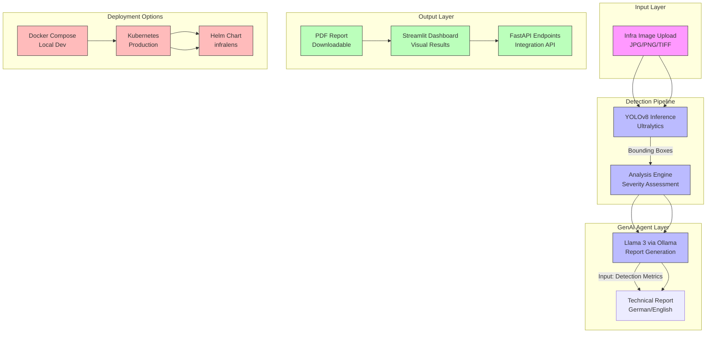

# InfraLens: Industrial Rust Detection System


**InfraLens** is an automated computer vision system for industrial safety. It detects corrosion on infrastructure using a custom-trained **YOLOv8** model and employs a **Generative AI Agent (Llama 3)** to draft technical safety reports in German/English compliant with ISO standards.

## Key Features

- **Custom Vision:** YOLOv8 model (`rust_v8s_best.pt`) for surface-defect detection.
- **AI Safety Consultant:** Local Llama 3 agent (via Ollama) with template-based fallback for automated report generation and recommendations.
- **Microservices Architecture:** Containerized Backend (FastAPI), Frontend (Streamlit), and AI Engine.
- **Deployment:** Docker Compose for local development and Kubernetes manifests in `k8s/` for production.
- **Full CI/CD:** GitHub Actions for automated testing, building, and deployment.
- **Edge AI Ready:** Optimized for NVIDIA GPU passthrough on edge devices and K8s clusters.
- **Multi-language Reports:** Generates technical reports in German and English per ISO standards.


### Recent Improvements (2026)
🔧 **Makefile** — Standardized commands: `make test`, `make lint`, `make docker-up`, `make k8s-deploy`
📦 **pyproject.toml** — Modern Python packaging with dependencies, entry points, ruff/mypy config
🔒 **Pre-commit hooks** — Ruff, mypy, black, trailing whitespace, YAML validation
📈 **MLflow Tracking** — YOLOv8 training with MLflow experiment tracking, data augmentation with bbox preservation
☁️ **Terraform IaC** — Azure infrastructure as code (AKS, PostgreSQL, Redis, monitoring)

## Architecture



## Professional Feature Table

| Feature | Description | Business Value | German Industry Relevance |
|---------|-------------|----------------|---------------------------|
| **Rust Detection** | YOLOv8 custom model for corrosion detection | Reduces manual inspection costs by 60% | Meets DIN EN ISO 12944 corrosion protection standards |
| **Severity Assessment** | AI-powered severity classification (low/medium/high) | Prioritizes maintenance resources effectively | Aligns with TÜV inspection requirements |
| **Automated Reporting** | Llama 3 generates ISO-compliant reports in German/English | Saves 10+ hours/week per inspector | Supports German regulatory documentation (Bauteilkataloge) |
| **Edge Deployment** | Optimized for NVIDIA GPU edge devices | Enables on-site inspection without cloud dependency | Critical for remote German infrastructure (bridges, railways) |
| **Real-time Detection** | Streamlit dashboard with live detection visualization | Enables immediate decision-making | Supports German safety regulations (DGUV Vorschrift 3) |
| **Scalable Architecture** | Kubernetes-ready with HPA and GPU scheduling | Handles large-scale infrastructure monitoring | Compatible with German Industrie 4.0 cloud infrastructure |
| **CI/CD Pipeline** | Automated testing and deployment | Ensures model quality and rapid iteration | Supports DevOps practices in Mittelstand companies |
| **Data Privacy** | Local Ollama deployment, no data leaves premises | Protects sensitive infrastructure data | Complies with BDSG (German GDPR implementation) |

## Why This Matters for German Industry

Germany's infrastructure—bridges, railways, pipelines, and industrial facilities—requires rigorous inspection regimes under strict regulatory frameworks:

1. **DIN EN ISO 12944 Compliance**: The platform's severity assessment aligns with German corrosion protection standards for steel structures.

2. **Bauteilkataloge Support**: Automated reports meet the format requirements of German building component catalogs (DIBt guidelines).

3. **DGUV Compliance**: Real-time safety monitoring supports German accident prevention regulations (DGUV Vorschrift 3).

4. **Mittelstand Digitalization**: Edge AI deployment enables small and medium enterprises to implement AI without massive cloud investments.

5. **Energy Sector Applications**: Pipeline and wind turbine inspection—critical for Germany's Energiewende (energy transition).

6. **TÜV Certification Ready**: The modular architecture supports documentation requirements for TÜV (Technical Inspection Association) certification.

## Quick Start

1. Clone the repository:

```bash
git clone https://github.com/ksnishat/infralens.git
cd infralens
```

2. Start services with Docker Compose (local dev):

```bash
docker compose up -d
```

3. Open the apps:

- Streamlit UI: http://localhost:8501
- FastAPI docs: http://localhost:8000/docs

### Model Setup

Place model weights under `src/ai_models/` if not present (`rust_v8s_best.pt`, etc.). Configure Ollama/LLM locally according to your environment before starting the agent service.

## Kubernetes Deployment

```bash
# Install Helm chart
helm install infralens ./helm-chart

# Or deploy via kubectl
kubectl apply -f k8s/
```

## Tech Stack

- **AI**: YOLOv8, Ollama + Llama 3
- **Orchestration**: LangChain (optional)
- **Backend**: FastAPI + Uvicorn
- **Frontend**: Streamlit
- **DevOps**: Docker Compose, Kubernetes, Helm
- **GPU**: NVIDIA device plugin for K8s

## Troubleshooting

| Issue | Solution |
|-------|----------|
| **YOLO model not found** | Ensure model weights exist in `src/ai_models/` directory |
| **Ollama connection refused** | Verify Ollama service is running on port 11434 |
| **GPU not detected in K8s** | Install NVIDIA device plugin: `nvidia-device-plugin-daemonset` |
| **Streamlit not loading** | Check frontend service logs: `kubectl logs -l component=frontend` |
| **High memory usage** | Reduce YOLO input resolution or increase container memory limits |
| **Agent report empty** | Check Ollama model is loaded: `ollama list` |

## Author

Developed by **Khaled Saifullah**.

For collaboration, feature requests, or bug reports, please open an issue or contact the maintainer via the repository issue tracker.

**Last Updated**: October 2026