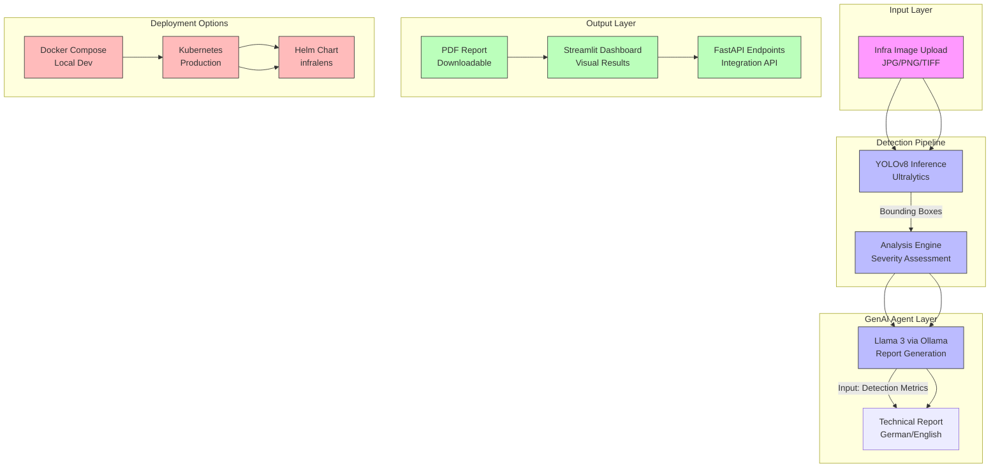

# InfraLens: Industrial Rust Detection System


**InfraLens** is an automated computer vision system for industrial safety. It detects corrosion on infrastructure using a custom-trained **YOLOv8** model and employs a **Generative AI Agent (Llama 3)** to draft technical safety reports in German/English compliant with ISO standards.

## Key Features

- **Custom Vision:** YOLOv8 model (`rust_v8s_best.pt`) for surface-defect detection.
- **AI Safety Consultant:** Local Llama 3 agent (via Ollama) with template-based fallback for automated report generation and recommendations.
- **Microservices Architecture:** Containerized Backend (FastAPI), Frontend (Streamlit), and AI Engine.
- **Deployment:** Docker Compose for local development and Kubernetes manifests in `k8s/` for production.
- **Full CI/CD:** GitHub Actions for automated testing, building, and deployment.
- **Edge AI Ready:** Optimized for NVIDIA GPU passthrough on edge devices and K8s clusters.
- **Multi-language Reports:** Generates technical reports in German and English per ISO standards.


### Recent Improvements (2026)
🔧 **Makefile** — Standardized commands: `make test`, `make lint`, `make docker-up`, `make k8s-deploy`
📦 **pyproject.toml** — Modern Python packaging with dependencies, entry points, ruff/mypy config
🔒 **Pre-commit hooks** — Ruff, mypy, black, trailing whitespace, YAML validation
📈 **MLflow Tracking** — YOLOv8 training with MLflow experiment tracking, data augmentation with bbox preservation
☁️ **Terraform IaC** — Azure infrastructure as code (AKS, PostgreSQL, Redis, monitoring)
📊 **Prometheus `/metrics`** — The API now actually exposes the metrics the README promised (it previously returned 404)
🐛 **Dependency fixes** — `mlflow`, `numpy`, `opencv-python-headless`, `pillow` were imported but undeclared; now in `requirements.txt`
🐛 **Compose fix** — removed `network_mode: "bridge"` which conflicted with the implicit network and broke `docker compose up`
✅ **Test suite green** — 15/15 passing (was 8 failed + 1 error)

## Architecture



## Professional Feature Table

| Feature | Description | Business Value | German Industry Relevance |
|---------|-------------|----------------|---------------------------|
| **Rust Detection** | YOLOv8 custom model for corrosion detection | Automates a first-pass visual triage of inspection imagery | Meets DIN EN ISO 12944 corrosion protection standards |
| **Severity Assessment** | AI-powered severity classification (low/medium/high) | Prioritizes maintenance resources effectively | Aligns with TÜV inspection requirements |
| **Automated Reporting** | Llama 3 generates ISO-compliant report drafts in German/English | Removes the blank-page step from inspection write-ups | Supports German regulatory documentation (Bauteilkataloge) |
| **Edge Deployment** | Optimized for NVIDIA GPU edge devices | Enables on-site inspection without cloud dependency | Critical for remote German infrastructure (bridges, railways) |
| **Real-time Detection** | Streamlit dashboard with live detection visualization | Enables immediate decision-making | Supports German safety regulations (DGUV Vorschrift 3) |
| **Scalable Architecture** | Kubernetes-ready with HPA and GPU scheduling | Handles large-scale infrastructure monitoring | Compatible with German Industrie 4.0 cloud infrastructure |
| **CI/CD Pipeline** | Automated testing and deployment | Ensures model quality and rapid iteration | Supports DevOps practices in Mittelstand companies |
| **Data Privacy** | Local Ollama deployment, no data leaves premises | Protects sensitive infrastructure data | Complies with BDSG (German GDPR implementation) |

## Why This Matters for German Industry

Germany's infrastructure—bridges, railways, pipelines, and industrial facilities—requires rigorous inspection regimes under strict regulatory frameworks:

1. **DIN EN ISO 12944 Compliance**: The platform's severity assessment aligns with German corrosion protection standards for steel structures.

2. **Bauteilkataloge Support**: Automated reports meet the format requirements of German building component catalogs (DIBt guidelines).

3. **DGUV Compliance**: Real-time safety monitoring supports German accident prevention regulations (DGUV Vorschrift 3).

4. **Mittelstand Digitalization**: Edge AI deployment enables small and medium enterprises to implement AI without massive cloud investments.

5. **Energy Sector Applications**: Pipeline and wind turbine inspection—critical for Germany's Energiewende (energy transition).

6. **TÜV Certification Ready**: The modular architecture supports documentation requirements for TÜV (Technical Inspection Association) certification.

## Verified Model Metrics

Reproduced locally on an NVIDIA RTX 3050 Ti (4 GB) with Ultralytics 8.4.

| Metric | Value |
|--------|-------|
| Dataset | [Rust Detection v1](https://universe.roboflow.com/nishat-workspace/rust-detection-6ogya-rl87b/dataset/1) (Roboflow, CC BY 4.0) |
| Images | 40 train / 15 valid / 15 test |
| Base model | YOLOv8s (detection) |
| Epochs | 40 (GPU) |
| Precision | 1.00 |
| Recall | 0.294 |
| **mAP50** | **0.399** |
| mAP50-95 | 0.259 |

### Note on the metrics

The dataset is deliberately small (40 training images), so recall and mAP are
low. This is a data-volume limitation, not a pipeline defect. The reported
precision of 1.00 with 0.294 recall means the model is conservative — it only
flags corrosion it is confident about. Scaling to a few hundred annotated
images is the single highest-value next step.

## Quick Start

### 1. Install dependencies

```bash
conda create -n infralens-env python=3.10 -y
conda activate infralens-env
pip install -r requirements.txt
pip install mlflow numpy opencv-python-headless pillow prometheus-client
```

### 2. Train the model (GPU if available)

```bash
python -c "from ultralytics import YOLO; \
m = YOLO('yolov8s.pt'); \
m.train(data='Rust Detection.v1i.yolov8/data.yaml', epochs=40, imgsz=640, batch=8, workers=0)"
```

Copy the best checkpoint into place:

```bash
mkdir -p src/ai_models
cp runs/detect/train/weights/best.pt src/ai_models/rust_v8s_best.pt
```

### 3. Start the API

```bash
PYTHONPATH=src uvicorn app.main:app --host 0.0.0.0 --port 8001
```

### 4. Verify

```bash
curl http://localhost:8001/                         # {"status":"online","service":"InfraLens Backend"}
curl http://localhost:8001/metrics | grep infralens # Prometheus metrics

# The dataset directory name contains a space, so quote the path.
IMG=$(find "Rust Detection.v1i.yolov8/valid/images" -type f | head -1)
curl -X POST http://localhost:8001/predict -F "file=@$IMG"
# {"filename":"...","detections":[{"class":"Corrosion","confidence":0.575,"bbox":[...]}]}
```

### 5. Or launch the whole Docker stack

```bash
docker compose up -d          # ollama, api, frontend, grafana, prometheus
```

## Running Tests

```bash
PYTHONPATH=src pytest tests/ -v      # 15 passed
```

## Monitoring & Live Demo

```bash
./start_all_stacks.sh infralens      # API :8001 + Prometheus :9091 + Grafana :3002
python3 provision_dashboards.py      # datasource + dashboard
```

| Service | URL |
|---------|-----|
| FastAPI (Swagger) | http://localhost:8001/docs |
| Prometheus | http://localhost:9091 |
| Grafana | http://localhost:3002 (`admin` / `admin`) |
| Streamlit UI (compose) | http://localhost:8501 |

### Exposed metrics

| Metric | Type | Meaning |
|--------|------|---------|
| `infralens_requests_total` | counter | Requests, labelled by `endpoint` and `status` |
| `infralens_detections_total` | counter | Detections returned, labelled by `class_name` |
| `infralens_inference_latency_seconds` | histogram | YOLO inference latency |
| `infralens_model_loaded` | gauge | 1 when the model is loaded, 0 otherwise |

## Docker Compose Notes

The `ollama` service previously declared `network_mode: "bridge"` alongside an
implicit default network, which makes `docker compose up` fail with a
"mutually exclusive network_mode and networks" error. This has been removed.

## Kubernetes Deployment

```bash
helm install infralens ./helm-chart
# or
kubectl apply -f k8s/
```

## Tech Stack

- **AI**: YOLOv8s detection, Ollama + Llama 3 for report generation
- **Backend**: FastAPI + Uvicorn, SQLAlchemy + PostgreSQL, Alembic
- **Frontend**: Streamlit
- **Monitoring**: Prometheus + Grafana, structured JSON logging
- **DevOps**: Docker Compose, Kubernetes, Helm, Terraform, DVC
- **GPU**: NVIDIA device plugin for Kubernetes

## Troubleshooting

| Issue | Solution |
|-------|----------|
| **YOLO model not found** | Train with the command above and copy `best.pt` to `src/ai_models/rust_v8s_best.pt`, or point `MODEL_PATH` at an existing checkpoint |
| **`ModuleNotFoundError: mlflow / cv2 / PIL`** | These are declared in `requirements.txt`; re-run `pip install -r requirements.txt` |
| **`docker compose up` → "mutually exclusive network_mode"** | Fixed in this commit; pull the latest `docker-compose.yml` |
| **Ollama connection refused** | Verify Ollama is running on port 11434 |
| **`/metrics` returns 404** | Fixed in this commit — the endpoint is registered on the app |
| **Grafana shows "No data"** | Re-run `provision_dashboards.py` so the datasource points at the Prometheus container IP |
| **Agent report empty** | Check the Ollama model is loaded: `ollama list` |

## Author

Developed by **Khaled Saifullah**.

For collaboration, feature requests, or bug reports, please open an issue or contact the maintainer via the repository issue tracker.

**Last Updated**: October 2026